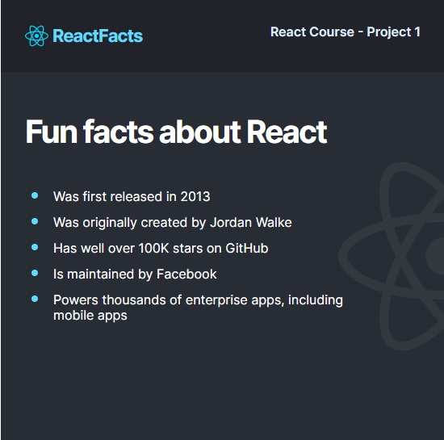

# React Information Site
Site uses [Vite](https://vitejs.dev/) dev tool.
 
Im learning react from a [Scrimba](https://scrimba.com/learn/learnreact).
 
This is a simple first dive into React by just making a single page and learning how to make and use components. 
Im super excited because its wasn't to bad! This project did have a step by step but by the time I got there I made it all on my own 
before the teacher went through the "how to" portion. It was exciting to see the difference in his code compared to mine even though he taught me how to do it.
I cant wait to learn more!
  
We were given a kind of design document to pull our colors and any images we needed to make the project from.
 
The goal here was to use react and CSS to recreate the template form [Figma](https://www.figma.com/file/xA1rJVQOorqMW6xjGdBLcI/ReactFacts?node-id=0%3A1).
 
# My site
 
Here is how mine turned out. Again this is nothing super fancy just the beginning of learning react and how it works.
 

